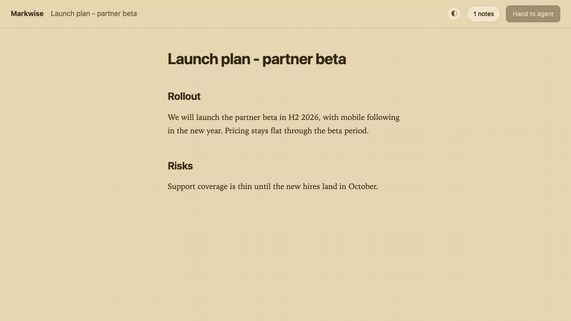

# Markwise

**Google-Docs-style review for the markdown your AI agent writes.**

Comment, reply, and suggest edits on an agent-written document in your browser. Every piece of
feedback is saved inside the markdown file itself - where any coding agent can read it, act on
it, and answer you, thread by thread.



## The problem

Agents hand you long, clean markdown - PRDs, specs, launch plans, architecture docs. Then your
feedback has to make it back to the agent, and that handoff is where everything falls apart.

Today you have two moves, and each loses something the agent needs:

- **Reply in chat.** *"In section 3, the timeline should be H2, not Q4..."* You describe
  locations in prose instead of pointing at them. The longer the doc, the worse it gets - and
  the feedback dies with the session.
- **Edit the file yourself.** The agent gets no structured signal: what changed, what is still
  open, what needs a response. A raw diff is not a review.

In Google Docs you would comment and suggest edits right on the text, with threads and states.
That fluency simply does not exist for the markdown an agent just wrote you.

## The idea

The problem is not that markdown needs comments. The problem is that **agent-written documents
need a durable feedback loop that both humans and agents can understand.**

So Markwise is not annotation syntax. It is a workflow contract:

1. **You leave anchored feedback** - comments and suggested insert/replace/delete edits, right
   on the text, in a browser preview.
2. **The agent revises the document** against every note, and **answers every item** - what
   changed, what it pushed back on.
3. **You decide what is resolved.** Closure is always the human's call. An agent never resolves
   a note.

Three properties make the loop durable:

- **In-file truth.** The document and all its review state are one self-contained artifact -
  no sidecar files, no database, no platform. It commits, diffs, and travels like any other
  markdown file.
- **Clean preview.** All review data hides in HTML comments. GitHub, VS Code, and every normal
  markdown renderer show the document clean.
- **Any agent.** Feedback has IDs, anchors, states, and instructions. `markwise prompt` bundles
  the document and every open note into a block you can hand to Claude Code, Codex, or any
  model. No lock-in.

## Why not just...

- **Google Docs / Notion** - your doc leaves the repo and the agent loses it. Truth moves out
  of the file.
- **PR review** - feedback anchors to diffs and lives in the forge, not the artifact. Prose is
  not code.
- **CriticMarkup** - useful prior art, but it is editorial syntax, not a review loop: no
  threads, no states, no agent replies - and raw markup leaks into every preview.
- **Chat** - "in section 3, the timeline..." - describing locations instead of pointing at
  them, in a transcript that scrolls away.

## Quick start

Paste this into Claude Code, Codex, or any coding agent:

> Install Markwise for me with `npm i -g markwise`, then run
> `markwise agent-setup` and follow what it prints.

That teaches your agent when to reach for Markwise and how to run the review loop. Or install
it yourself:

```bash
npm i -g markwise
markwise preview your-doc.md     # opens a localhost previewer
```

Requires Node 20+. Contributors: build from source with `pnpm install && pnpm run build`.

## One review loop, end to end

1. Your agent writes `launch-plan.md` and opens it for you: `markwise preview launch-plan.md`.
2. In the browser, you select a sentence and leave a comment. You select a date and type a
   correction - it becomes a suggested replacement, shown inline. Everything you do is saved
   into the file as you go.
3. Your agent runs `markwise prompt launch-plan.md`, which emits the instruction block, every
   note waiting on the agent, and the document. The agent revises the doc and replies in each
   thread.
4. `markwise status launch-plan.md` tells you it is your turn. Back in the previewer, you read
   the agent's replies, push back where it missed, and resolve what is done.
5. Need a clean copy for someone outside the loop? `markwise export` writes one with every
   trace of review stripped - the original is never touched.

## How it works

Review state lives in HTML comments, invisible in any rendered view:

```markdown
We launch the partner beta in <!-- mw: n1 -->Q4 2026<!-- /mw: n1 -->, with
mobile following in the new year.

<!-- mw:log v=1
{"id":"n1","type":"comment","state":"open", ... ,"thread":[
  {"by":"reviewer","at":"...","body":"We agreed H2, not Q4."}]}
-->
```

Inline markers pin each note to the exact text it is about; a single log block at the bottom of
the file holds the threads and state. Anchors carry a content hash plus surrounding context, so
notes survive the agent rewriting the document around them - and `markwise lint --fix` repairs
mechanical drift (never prose). When you want the review data gone, `markwise export` produces
a clean copy.

## The toolkit

| Command | What it does |
|---------|--------------|
| `markwise preview <file>` | Review in the browser: comment, reply, suggest edits, resolve. Three themes. |
| `markwise prompt <file>` | Bundle the doc and every open note into an instruction block for any model. |
| `markwise status <file>` | Whose turn is it? Open vs resolved, waiting on you vs waiting on the agent. |
| `markwise lint <file>` | 24 rules guard the review data; `--fix` repairs mechanical drift, never prose. |
| `markwise export <file>` | A clean copy with every trace of review stripped. Never modifies the original. |
| `markwise agent-setup` | Print the instructions that wire Markwise into your coding agent. |

Full flags, exit codes, and behavior: [docs/commands.md](docs/commands.md).

## Status and limitations

Markwise is young and moving fast. What works today: the full protocol (lint, status, prompt,
export), and a previewer with comments, threaded replies, resolve/discard, suggested
insert/replace/delete edits, keyboard selection, and three themes - backed by 160+ unit tests
and a browser e2e suite.

Honest limitations:

- The previewer serves **one file per process**, on localhost, for a single reviewer. It is a
  review surface, not a collaboration server.
- The protocol is **v1 and may still evolve**; `markwise lint` is the compatibility guarantee.
- Suggested edits cover prose spans; they do not yet restructure tables or move whole sections.

## Feedback

Markwise is shaped by the people using it. To tell us what worked and what did not:

```bash
markwise feedback
```

Three short questions, then your answers are posted as a public issue on
[farandclose/markwise](https://github.com/farandclose/markwise/issues) - no GitHub account or
login needed. Leave a handle or email if you are open to follow-up questions; the command
prints the issue link so you can subscribe to it too. Prefer to write directly?
[Open an issue](https://github.com/farandclose/markwise/issues/new) any time.

## License

[MIT](LICENSE)
