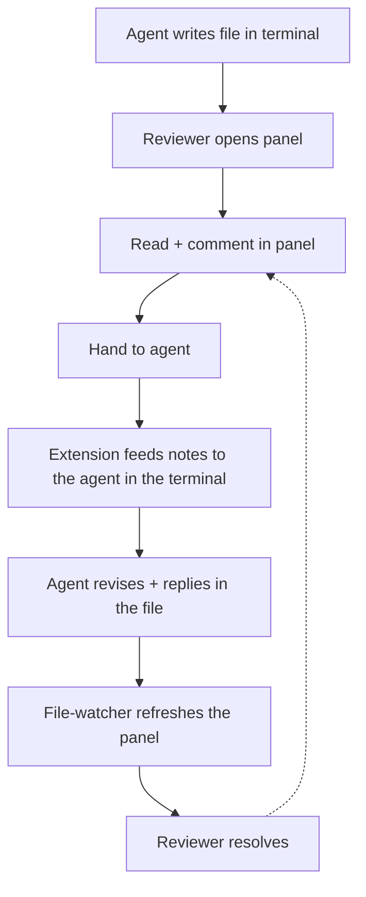

# VS Code extension for Markwise — requirements

## Summary

A VS Code extension that opens markwise's existing previewer inside an editor panel, so a
reviewer reads and comments on the rendered document without leaving VS Code. The agent runs in
the same window's terminal, so the extension drives the handoff in place (`markwise prompt`) and
watches the file so the agent's replies appear in the panel on their own. Standalone — one
install, no separate CLI — is the committed direction, not the v1 cut.

---

## Problem Frame

VS Code is where the work already lives: the project and its files are browsed there, and the
agent (Claude Code, Codex CLI) runs in the integrated terminal. Markwise's review surface,
though, is a separate localhost browser tab. So a single review loop today means hopping
windows — VS Code to write, browser to read and comment, back to VS Code to hand the notes to
the agent, back to the browser to read its replies — carrying feedback across the gap by hand.

The browser previewer can't close that gap, because it is structurally a sibling tab to wherever
the agent runs. Moving the review surface into the editor is what lets the loop — comment,
revise, reply — happen in one window, beside the terminal the agent already occupies.

---

## Key Decisions

- **Rendered webview, not VS Code's native comment UI.** The panel renders the formatted
  document and reuses markwise's own commenting; it does not anchor threads to lines of raw
  markdown source via VS Code's comment API. Native source-line comments would turn a
  document review into a code review of the `.md` and discard the "prose leads" identity — and
  would mean rebuilding the note model instead of reusing the previewer.

- **Seamless handoff in v1.** The extension drives the integrated terminal so the existing
  handoff needs no pre-parked `markwise prompt --wait` and no clipboard paste. This is a small
  addition on top of the webview, and it is what makes the in-editor loop feel native rather
  than "a browser tab moved into a panel."

- **Refresh by watching the file, not the terminal.** Because all review state lives in the
  file, the panel re-renders on a file change. The agent's replies (written into the `.md`)
  surface with no terminal-output scraping — the in-file-truth principle carries the refresh.

- **Complements, does not replace, the browser previewer.** `markwise preview` stays as-is for
  reviewers who are not in VS Code.

- **Standalone is the direction; the bundle-vs-shell-out path for v1 is open.** Because the
  extension runs in VS Code's Node extension host, it can eventually import markwise as a library
  and ship as one Marketplace install. Whether v1 already takes that route or shells out to the
  installed CLI first is the open fork (see Outstanding Questions).

---

## Actors

- A1. **Reviewer** — the human; reads, comments, and resolves in the panel.
- A2. **Agent** — runs in the integrated terminal; revises the document and replies via the file.
- A3. **Extension** — hosts the panel, drives the terminal on handoff, and watches the file.

---

## Requirements

**Review surface (in-editor previewer)**

- R1. The extension opens a markdown file's markwise previewer inside a VS Code editor panel,
  rendering the formatted document — not the raw source.
- R2. The existing review experience carries over intact: clean read plus notes rail, comment
  and reply, suggested insert / replace / delete, resolve and discard, and the three themes.
- R3. The panel reads and writes notes through the file as today; it reflects the file's current
  review state and stores new notes back into it.
- R4. The panel reuses markwise's existing rendering and note model; it does not reimplement
  commenting on VS Code's native comment API.

**Handoff and loop (one window)**

- R5. The existing "Hand to agent" handoff works from inside the editor.
- R6. On handoff, the extension drives the integrated terminal — starting the waiter or injecting
  `markwise prompt <file>` into the running agent — so no pre-parked `--wait` and no manual paste
  are required.
- R7. The extension watches the file and refreshes the panel when the agent writes replies back,
  so replies appear without a manual reload.

**Packaging and compatibility**

- R8. v1 may require the `markwise` CLI to be installed; the extension invokes it for the engine
  and handoff.
- R9. The extension is distributed through the VS Code Marketplace.
- R10. The browser previewer (`markwise preview`) and all existing CLI behavior are unchanged.

---

## Key Flows

- F1. **In-editor review loop**
  - **Trigger:** The agent writes a document in the terminal and the reviewer opens its panel.
  - **Actors:** A1, A2, A3
  - **Steps:** Reviewer reads and comments in the panel; clicks Hand to agent; the extension
    feeds the open notes to the agent in the terminal; the agent revises the file and replies;
    the file-watcher refreshes the panel; the reviewer reads replies and resolves.
  - **Outcome:** One full comment → revise → reply → resolve loop, without leaving VS Code.
  - **Covered by:** R5, R6, R7

The whole loop stays inside one VS Code window; the dashed return is iteration on an open note
before it is resolved.

---

## Acceptance Examples

- AE1. **Covers R6, R7.** Given the agent is running in the terminal, when the reviewer clicks
  Hand to agent, then the open notes reach the agent with no paste, the agent revises the file,
  and the panel refreshes to show its replies.
- AE2. **Covers R7.** Given a panel open on a file, when the file's review state changes from any
  source, then the panel re-renders to reflect it without a manual reload.
- AE3. **Covers R8.** Given the `markwise` CLI is not installed, when the reviewer triggers an
  action that needs it, then the extension surfaces a clear, actionable message rather than
  failing silently.

---

## Scope Boundaries

**Deferred for later**

- Native polish: open from the command palette / right-click a `.md`, a status-bar "your turn"
  indicator, auto-open behavior, and gutter dots on commented source lines.
- Standalone / self-contained packaging: bundle the markwise engine as a library so the extension
  is one Marketplace install with no separate CLI. This is the committed direction, sequenced
  after v1.
- Multi-file, multi-reviewer, or any collaboration server. The panel stays single-file, matching
  the previewer's one-file-per-process posture today.

**Outside this product's identity**

- VS Code's native source-line comment UI as the review surface — it reviews raw markdown as if it
  were code and breaks "the prose leads." A narrow source-side affordance (for example, a gutter
  dot that jumps to a note) could be revisited later, but commenting on source is not the surface.

---

## Dependencies / Assumptions

- The extension runs in VS Code's Node extension host, which is what lets it both drive terminals
  and, later, import markwise as a library.
- v1 assumes the `markwise` CLI is installed and on PATH.
- Single file per panel, matching the previewer's current model.
- Reuses existing markwise internals rather than new engines: `src/preview/server.ts`,
  `src/preview/render.ts`, `src/preview/handoff.ts`, `src/preview/wait.ts`,
  `src/preview/rendezvous.ts`, and `src/cli.ts`.

---

## Outstanding Questions

**Deferred to planning**

- Bundle vs shell-out for v1: does v1 import markwise as a library (landing on the standalone path
  directly) or shell out to the installed CLI first and convert later? The first is cleaner toward
  the north-star; the second reaches a working v1 faster but builds a handoff path that gets
  replaced. The product direction (standalone) is settled; this is the v1 sequencing call.
- Webview hosting: load the existing localhost preview server inside the webview, or serve the
  previewer assets through the extension and bridge saves via the extension host.
- Terminal targeting: how the extension identifies the agent's terminal and chooses between
  injecting `markwise prompt <file>` and auto-starting the `--wait` waiter, plus the fallback when
  no agent terminal can be identified.
- Exact wording and recovery path when the CLI is missing (AE3).

---

## Success Criteria

- A reviewer opens a `.md`, reads, comments, hands to the agent, and sees the replies — entirely
  inside VS Code, with no browser tab.
- The review experience matches the browser previewer in feel: document-first, same commenting,
  same themes; identity is preserved.
- The handoff requires no pre-parked `--wait` and no manual paste.
- The browser previewer and all existing CLI behavior are unaffected.
