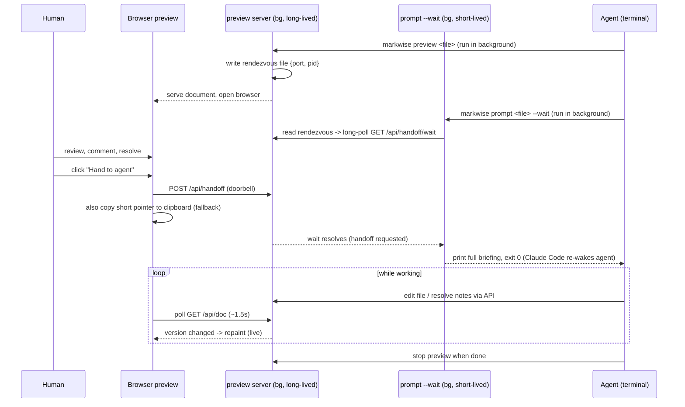

# feat: Live agent handoff with a preview that stays open

## Summary

Today the previewer's "Hand to agent" button is a dead-end clipboard copy: it writes a short pickup
ticket to the clipboard and the human manually pastes it into their agent. This plan closes the loop
**and** keeps the preview alive so the human watches the agent work.

When the human clicks "Hand to agent", a doorbell signal reaches the agent that launched the preview;
the agent receives the full briefing automatically and starts editing the document. The preview
server stays running, and the browser auto-refreshes so the human sees paragraphs rewrite and notes
resolve in near-real-time. The clipboard copy stays as a manual fallback.

The key constraint that shapes everything: the preview server must **stay alive** through the
handoff, so the old "the command exits = the signal" trick cannot be used. The signal is instead
delivered by a separate, short-lived waiter process that exits (waking the agent) while the server
keeps serving.

---

## Problem Frame

`markwise preview <file>` (`src/cli.ts:311`) starts a localhost HTTP server on a dynamic port and
**intentionally never exits** - the listening server keeps the event loop alive until Ctrl+C. The
"Hand to agent" button (`src/preview/assets/app.js`, click handler ~line 543) is **purely
client-side**: it calls `copyToClipboard(handoff.text)` and shows a toast. It makes zero contact with
the server, so nothing can travel back to the terminal. The handoff text itself is a short pointer
built by `buildHandoffText` (`src/preview/handoff.ts`) telling the agent to run `markwise prompt`.

Two gaps stand between today and the desired experience:

1. **No path from button to agent.** The button cannot signal the launching process, and the server
   has no endpoint to receive such a signal.
2. **No live channel to the browser.** The preview only re-fetches `GET /api/doc` when the *human*
   acts (reply/resolve/create repaint via `load()`). There is no WebSocket/SSE/poll, so an agent
   editing the file in the background would be invisible until the human clicked something.

The render path itself is already live-friendly: `GET /api/doc` re-reads the file on every request
(`src/preview/server.ts:193`) and returns a `version` fingerprint. What is missing is a *trigger* to
re-fetch, plus a way to keep the server running while the handoff signal reaches the agent.

---

## Requirements

- **R1** Clicking "Hand to agent" signals the launching agent to begin, with no human terminal action.
- **R2** The agent receives the **full briefing** (protocol + notes waiting on it + the document) - the
  same output `markwise prompt` produces today - not just the short pointer.
- **R3** The preview stays open and live after handoff; the human watches the document update in
  near-real-time as the agent edits prose and resolves notes.
- **R4** The clipboard fallback remains, copying today's short pointer text for the manual-paste case.
- **R5** The agent launches the preview server in the background; it survives the handoff and runs
  until explicitly stopped.
- **R6** Concurrent human/agent access to the same document is handled gracefully - no raw stale-version
  errors surface to the human during live-watch.
- **R7** The new endpoints preserve the existing localhost-only security posture (loopback Host gate +
  a custom-header CSRF guard).

---

## High-Level Technical Design

Five participants. The two background processes (server + waiter) are the heart of the design: one
stays alive to keep the preview live, the other exits to wake the agent.

**Why two processes.** A single process cannot both stay alive (to keep the preview live) and exit
(to hand the briefing back to the agent). So the **server** is one long-lived background process and
the **waiter** (`prompt --wait`) is a separate short-lived background process whose *exit* is the
wake signal. Backgrounding the waiter rather than running it in the foreground also sidesteps the
~10-minute foreground-command timeout, since a human review can take arbitrarily long.

**Why the waiter is `prompt --wait`.** `markwise prompt` already assembles the exact briefing we want
to deliver (`buildPromptOutput`, `src/prompt.ts`). `--wait` only changes *when* it emits: it blocks
until the doorbell, then prints the same briefing and exits. No briefing logic is duplicated.

---

## Key Technical Decisions

- **KTD1 - Long-lived server, separate exiting waiter.** Keep `markwise preview` alive through handoff;
  deliver the wake signal via a separate process that exits. *(R1, R3, R5)*
- **KTD2 - Reuse `prompt` as the waiter via a `--wait` flag** rather than a new command. `prompt --wait`
  discovers the running server, blocks on the doorbell, then emits the existing briefing. *(R2)*
- **KTD3 - Rendezvous file for discovery.** `markwise preview` writes a small file in the OS temp dir,
  keyed by a hash of the document's absolute path, recording `{ port, pid, file }`; it is removed on
  shutdown. The waiter reads it to find the dynamic port. Simplest local IPC, consistent with the
  localhost-only posture. *(R5)*
- **KTD4 - Doorbell = `POST /api/handoff`; wake = long-poll `GET /api/handoff/wait`.** The button POSTs
  the doorbell; the waiter long-polls the wait endpoint, which resolves the instant the doorbell rings
  (or immediately if it already has). Responsive, no file-polling races. *(R1)*
- **KTD5 - Live refresh by client polling `GET /api/doc` (~1.5s), repaint only on version-hash change,
  pause when the tab is hidden.** The render path already re-reads the file and returns a fingerprint;
  polling is cheap on localhost and avoids new SSE/WebSocket infrastructure. *(R3)*
- **KTD6 - Two channels.** Auto-handoff returns the full briefing (R2); the clipboard keeps the short
  pointer (R4), because a human will not want to paste an entire document.
- **KTD7 - Agent edits are authoritative during live-watch.** The poll advances the browser's known
  `version`; a human action against a superseded version triggers a friendly auto-refresh ("the agent
  just updated this") instead of surfacing the raw 409. The server's version-precondition is unchanged.
  *(R6)*
- **KTD8 - New endpoints reuse the loopback Host gate and require a custom request header** (same
  preflight trick that protects mutations today), so a hostile local page cannot forge a handoff. The
  handoff endpoints are not document mutations, so they do **not** require `x-mw-version`. *(R7)*

---

## Implementation Units

### U1. Server: handoff doorbell, wait endpoint, and handoff state

**Goal:** Give the preview server a way to receive the doorbell and let a waiter block until it rings.
**Requirements:** R1, R7
**Dependencies:** none
**Files:** `src/preview/server.ts`, `test/preview/` (new `handoff-endpoint.test.ts`)
**Approach:** Add per-server handoff state (a boolean plus a set of pending resolvers). Add
`POST /api/handoff` - sets the flag, resolves any waiters, returns 200. Add `GET /api/handoff/wait` -
if handoff already requested, return 200 immediately; otherwise hold the response open until the
doorbell rings (with a long-poll timeout that returns a "keep waiting" status so the waiter can
re-poll). Route both **after** the existing loopback Host gate (`src/preview/server.ts:128`). Require a
custom header (e.g. `x-mw-handoff: 1`) on `POST /api/handoff` so it inherits the same CORS-preflight
protection mutations get; do **not** require `x-mw-version` (handoff is not a doc mutation).
**Patterns to follow:** the existing route blocks and `sendError` helper in `src/preview/server.ts`;
mirror the Host-gate placement and the custom-header reasoning documented at lines 26-31.
**Test scenarios:**
- `POST /api/handoff` sets state and returns 200; a subsequent `GET /api/handoff/wait` resolves at once.
- `GET /api/handoff/wait` issued *before* the doorbell stays pending, then resolves when `POST /api/handoff` arrives.
- Long-poll timeout returns the "keep waiting" status (not an error) so the waiter can re-poll.
- `POST /api/handoff` without the `x-mw-handoff` header is rejected.
- Request with a non-loopback Host is rejected 403 (gate still applies to the new routes).
- Double `POST /api/handoff` is idempotent (second is a no-op 200).
**Verification:** New endpoint tests pass; existing server tests in `test/preview/` and `test/integration.test.ts` still pass.

### U2. Rendezvous: preview advertises its port; discovery helper

**Goal:** Let a separate process find the running server's dynamic port for a given document.
**Requirements:** R5
**Dependencies:** none
**Files:** `src/preview/rendezvous.ts` (new), `src/cli.ts` (`previewCommand`, ~line 311), `test/preview/rendezvous.test.ts` (new)
**Approach:** New module with `writeRendezvous(file, {port, pid})`, `readRendezvous(file)`, and
`removeRendezvous(file)`. Path = `os.tmpdir()` + a hash of the document's **absolute** path (reuse
`shortHash` from `src/hash.ts`). In `previewCommand`, write the rendezvous inside the `server.listen`
callback once the real port is known, and register a SIGINT/`exit` handler to remove it. `readRendezvous`
returns null when the file is missing or its pid is no longer alive (stale-file guard).
**Patterns to follow:** `shortHash` usage already imported in `src/preview/server.ts`; the platform
temp-dir + EOL handling conventions in `src/eol.ts`.
**Test scenarios:**
- `writeRendezvous` then `readRendezvous` round-trips `{port, pid, file}`.
- Two different document paths produce two distinct rendezvous files.
- `removeRendezvous` deletes the file; `readRendezvous` then returns null.
- `readRendezvous` returns null for a file whose recorded pid is dead (stale guard).
**Verification:** Rendezvous tests pass; `markwise preview` leaves no rendezvous file behind after Ctrl+C (manual check + unit coverage of the removal path).

### U3. CLI: `markwise prompt <file> --wait` (the waiter)

**Goal:** A backgroundable command that blocks until handoff, then emits the full briefing and exits.
**Requirements:** R1, R2, R5
**Dependencies:** U1, U2
**Files:** `src/cli.ts` (`promptCommand`, line 212; arg parsing ~line 64; usage text ~line 19), `test/prompt.test.ts`
**Approach:** Add `--wait` to arg parsing and usage. When set, `promptCommand` resolves the document's
rendezvous (U2); if none, exit 2 with a clear message ("no live preview found for `<file>` - run
`markwise preview <file>` first"). Otherwise long-poll `GET /api/handoff/wait` (U1) until the doorbell
rings, then build and print the **same** briefing the non-wait path prints today (`buildPromptOutput`)
and exit 0. If the server disappears mid-wait (connection refused / rendezvous removed), exit cleanly
with a message rather than hanging or crashing. Non-`--wait` behavior is unchanged.
**Execution note:** Start with a failing test for the contract "`--wait` emits the briefing only after the doorbell".
**Patterns to follow:** existing `promptCommand` briefing assembly and exit codes (0 success / 2 error); reuse `buildPromptOutput` from `src/prompt.ts`.
**Test scenarios:**
- With a running server, `--wait` blocks; after a simulated `POST /api/handoff`, it prints the full briefing (protocol + waiting notes + document) and exits 0. *(Covers R2)*
- Without `--wait`, output is byte-identical to today (regression guard).
- `--wait` with no rendezvous / no running server exits 2 with the guidance message.
- Server vanishes mid-wait -> graceful non-zero exit with a message, no hang.
**Verification:** `test/prompt.test.ts` passes including the unchanged-by-default case; manual: background `prompt --wait`, click the button, confirm the agent receives the briefing.

### U4. Frontend: rewire "Hand to agent" to ring the doorbell (clipboard kept)

**Goal:** Make the button signal the server while preserving the clipboard fallback.
**Requirements:** R1, R4
**Dependencies:** U1
**Files:** `src/preview/assets/app.js` (handler ~line 543), `src/preview/assets/index.html`, `src/preview/assets/app.css`
**Approach:** In the click handler, `POST /api/handoff` (with the `x-mw-handoff` header) **and** keep
the existing `copyToClipboard(handoff.text)` call. Update the toast to reflect the new reality
("Handed off - your agent is on it. Watch it work here." with a clipboard-fallback note if the POST
fails). Leave the disabled-when-no-notes-waiting behavior intact.
**Patterns to follow:** the existing `copyToClipboard` + `showToast` flow; fetch calls elsewhere in `app.js` that already attach `x-mw-version` (mirror header-attachment style).
**Test scenarios (Playwright, `test/e2e/smoke.spec.ts` or a new spec):**
- Clicking "Hand to agent" fires `POST /api/handoff`.
- The clipboard still contains the short pointer text after the click. *(Covers R4)*
- Toast appears; on a forced POST failure the toast names the clipboard fallback.
- Button remains disabled when zero notes are waiting on the agent.
**Verification:** e2e spec passes; manual click shows toast and the backgrounded waiter wakes.

### U5. Frontend: live auto-refresh poll

**Goal:** The preview repaints on its own as the file changes underneath it.
**Requirements:** R3
**Dependencies:** none (uses existing `GET /api/doc`)
**Files:** `src/preview/assets/app.js`
**Approach:** Add a poll loop (~1.5s) calling `GET /api/doc`; compare the returned `version` against the
last-rendered version and only repaint (via the existing `load()`/render path) when it changed. Pause
polling when `document.hidden` and resume on focus. Keep the browser's known `version` updated from each
poll (this is the input U6 relies on).
**Patterns to follow:** the existing `load()` fetch-and-repaint function; the `version` fingerprint already returned by `/api/doc`.
**Test scenarios (Playwright):**
- An external edit to the file appears in the preview within one poll interval. *(Covers R3)*
- No repaint occurs while the version is unchanged (no flicker / no scroll jump).
- Resolving a note out-of-band makes it disappear from the preview live.
- Polling pauses when the tab is hidden and resumes on focus.
**Verification:** e2e spec drives an external edit and asserts the DOM updates without user action.

### U6. Concurrency: graceful version-skew during live-watch

**Goal:** Keep the human's session sane while the agent edits the same document.
**Requirements:** R6
**Dependencies:** U5
**Files:** `src/preview/assets/app.js` (and minor response-shaping in `src/preview/server.ts` if needed)
**Approach:** Treat agent edits as authoritative. The U5 poll keeps the client's `version` current; if a
human mutation (reply/resolve/create) is rejected with the existing 409 stale-version response, catch it,
auto-refresh to the latest version, and show a friendly "the agent just updated this - refreshed" notice
instead of the raw error, re-enabling the human to retry against current state. No change to the server's
precondition semantics.
**Patterns to follow:** the existing 409/`x-mw-version` mutation flow and `persist()` precondition at `src/preview/server.ts:90`; the existing toast/notice mechanism.
**Test scenarios (Playwright):**
- Human submits a reply after the agent has edited the doc -> friendly refresh notice, not a raw 409. *(Covers R6)*
- After the notice, retrying the same reply against the refreshed version succeeds.
- A resolve/discard issued against a superseded version is handled the same way.
**Verification:** e2e spec simulates an interleaved agent edit + human action and asserts the friendly path.

### U7. Agent-setup guidance for the live-handoff flow

**Goal:** Tell agents how to launch and consume the new flow correctly.
**Requirements:** R1, R2, R3, R5
**Dependencies:** U3, U4
**Files:** `SETUP_PROMPT.md`, `AGENT_PROMPT.md`, `test/setup.test.ts`
**Approach:** Update `SETUP_PROMPT.md` so the agent's instructions are: (1) run `markwise preview <file>`
in the **background** (server stays alive, browser opens); (2) run `markwise prompt <file> --wait` in the
**background** to receive the briefing the moment the human hands off; (3) when the waiter returns, act on
the briefing - edit the file and resolve notes through Markwise - while the preview stays live for the
human to watch; (4) stop the preview when done. Add a short note to `AGENT_PROMPT.md` that the human may be
watching live, so the agent should make tidy, incremental edits. Keep the no-em-dash / no-`--` rule.
**Patterns to follow:** existing structure and tone of `SETUP_PROMPT.md` and `AGENT_PROMPT.md`; the
`agent-setup` command wiring in `src/cli.ts:358` and `src/setup.ts`.
**Test expectation:** none for prose content beyond the existing `test/setup.test.ts` smoke check that
`agent-setup` prints the template; extend that check to assert the new background-launch guidance is present.
**Verification:** `test/setup.test.ts` passes; `markwise agent-setup` output reads as a coherent, runnable flow.

---

## Alternatives Considered

- **Single process that forks and detaches the server on handoff** (parent exits to wake the agent, a
  detached child keeps serving). Rejected: detaching a live HTTP server mid-flight is fragile and
  platform-sensitive; the two-process model (KTD1) is explicit and testable.
- **Server-Sent Events / WebSocket for live refresh** instead of polling (KTD5). Deferred, not rejected:
  cleaner push semantics, but adds connection-lifecycle complexity for a localhost, single-client preview
  where a 1.5s poll is imperceptible. Revisit if very large documents make full re-fetch costly.
- **Agent polls for handoff itself** (background `preview`, then the agent periodically checks a status
  command). Rejected: makes the agent busy-wait / re-invoke on a timer; the exiting-waiter model wakes it
  exactly once, on the doorbell.
- **Keystroke injection into a separate terminal** (TIOCSTI / AppleScript / tmux). Rejected as a non-goal:
  OS-specific, security-gated, brittle. The "agent that launched it" target makes it unnecessary.

---

## Risks & Mitigations

- **Briefing truncation on wake.** A backgrounded command's captured output could be truncated for a very
  large document. *Mitigation:* the briefing names notes by id and includes the protocol; if the agent
  detects truncation it can re-run `markwise prompt <file>` (server still alive). Note this in U7 guidance.
- **Orphaned server / stale rendezvous.** If the agent never stops the server, it lingers. *Mitigation:*
  rendezvous removal on SIGINT/exit (U2) + a dead-pid stale guard in `readRendezvous`; consider a
  `markwise stop <file>` convenience (Deferred).
- **Doorbell forgery from another local page.** *Mitigation:* loopback Host gate + required custom header
  (KTD8), matching the existing mutation protection.
- **Edit storms causing flicker.** Rapid agent edits could repaint mid-scroll. *Mitigation:* repaint only on
  version change and preserve scroll position in the render path (validate in U5).

---

## Open Questions / Deferred

- **`markwise stop <file>`** convenience to shut the preview via the rendezvous pid. Nice-to-have; not
  required (the human can close the tab / Ctrl+C, or the agent can kill the background process). *Deferred.*
- **Separate human -> separate-agent-session** handoff (the keystroke-injection scenario). Explicitly
  **out of scope** per the chosen "agent that launched it" target.
- **SSE upgrade** for live refresh if polling proves costly on large docs (see Alternatives). *Deferred.*

---

## Sources & Research

- Local architecture map (this repo): `src/cli.ts` (`previewCommand` 311, `promptCommand` 212, `agent-setup` 358),
  `src/preview/server.ts` (routes + security gates 26-31/128/90/193), `src/prompt.ts` (`buildPromptOutput`),
  `src/preview/handoff.ts` (`buildHandoffText`), `src/preview/assets/{app.js,index.html,app.css}`,
  templates `AGENT_PROMPT.md` / `SETUP_PROMPT.md` / `AUTHOR_PROMPT.md`, tests in `test/` + `test/e2e/smoke.spec.ts`.
- No external research was run: the work is local multi-process coordination and a poll loop, all strongly
  patterned in the existing codebase; the localhost-only posture makes polling the obvious low-risk choice.
