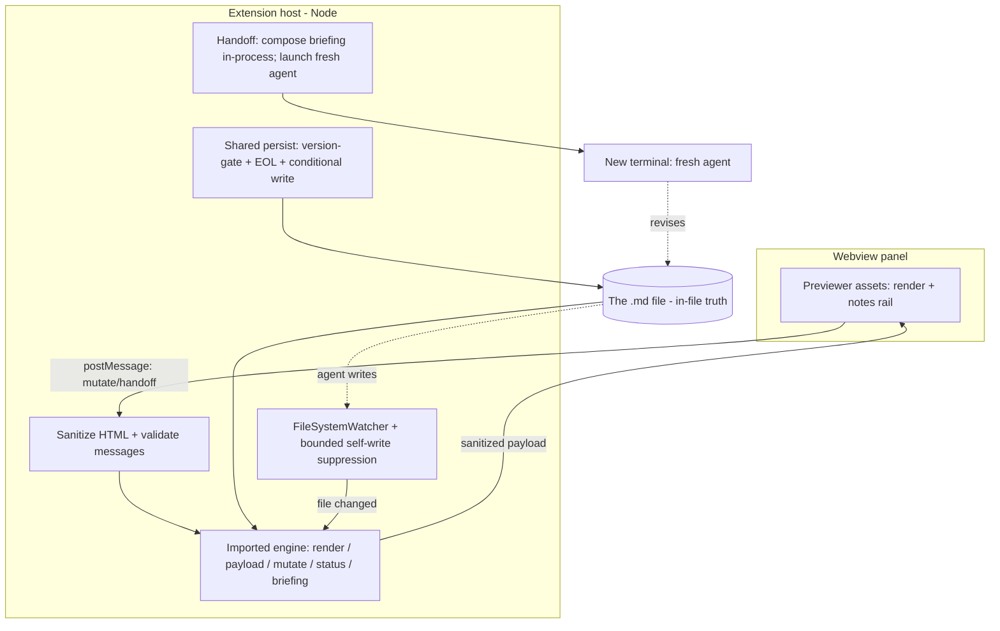

# feat: Markwise VS Code extension (v1)

## Summary

A VS Code extension that hosts Markwise's previewer inside an editor panel by importing the
Markwise engine and bridging through VS Code's own webview, file, and terminal APIs — so a reviewer
reads and comments on the rendered document, hands off to a fresh agent, and sees its replies, all
without leaving the editor. v1 is self-contained: the engine is bundled and the handoff briefing is
composed in-process, so the core loop needs no separately installed `markwise` CLI.

---

## Problem Frame

VS Code is where the files are browsed and where the agent (Claude Code / Codex CLI) runs in the
integrated terminal. Markwise's review surface is a separate localhost browser tab, so one review
loop means hopping VS Code → browser → VS Code → browser, carrying feedback across the gap by hand.
Moving the review surface into the editor lets the loop close in one window. The engine is already
built as a pure core plus a thin localhost-server shell (see Sources), so the extension reuses the
review experience without rebuilding it — the work is wiring that engine to VS Code's native
surfaces instead of to an HTTP server.

---

## Requirements

**Review surface**

- R1. The extension opens a markdown file's Markwise previewer in a VS Code editor panel, rendering
  the formatted document, not raw source (origin R1, R4).
- R2. The existing review experience carries over intact: clean read plus notes rail, comment and
  reply, suggested insert / replace / delete, resolve and discard, and the three themes (origin R2).
- R3. The panel reads and writes notes through the file and reflects the file's current review
  state (origin R3).

**Handoff and refresh**

- R4. The handoff works from inside the editor with no manual paste: the extension composes the
  briefing in-process and launches a fresh agent in the terminal with it (origin R5, R6; mechanism
  reframed — see KTD5).
- R5. The panel refreshes when the agent writes the file, without a manual reload, and the
  extension's own saves do not trigger a spurious refresh (origin R7).
- R6. Concurrent writes are safe: a stale save is rejected by a version precondition, and the panel
  reconciles when the file changed underneath it, including when the file is open in an editor tab
  with unsaved edits (new, from research).

**Safety**

- R7. Untrusted document content and inter-process messages cannot execute code: agent-authored
  markup in the rendered document is neutralized before display, webview→host messages are
  validated at the bridge, and file paths are shell-safe when written to the terminal (new, from
  security review).

**Packaging and compatibility**

- R8. The review loop (render, comment, save, refresh, handoff) requires no separately installed
  `markwise` CLI — the engine is bundled and the briefing is composed in-process (origin R8;
  standalone pulled into v1 — see KTD2 and Scope Boundaries).
- R9. The extension is published to both the VS Code Marketplace and Open VSX (origin R9, expanded).
- R10. The browser previewer (`markwise preview`) and all existing CLI behavior remain unchanged;
  the engine's existing public exports stay stable (origin R10).

---

## Key Technical Decisions

- KTD1. **Webview loads the previewer assets directly, not the localhost server.** The host serves
  the existing `app.js` / `app.css` via `asWebviewUri` under a strict CSP with a per-load nonce, and
  talks to the extension host over `postMessage`. Pointing the webview at `http://127.0.0.1:PORT`
  fights CSP, breaks in web/remote editors, and re-introduces the loopback attack surface. Note that
  serving assets via `asWebviewUri` is independent of where the engine runs — but the no-server
  choice forces the in-process handoff in KTD5, because the existing `--wait` handoff is structurally
  tied to that server (see Open Questions and Sources).

- KTD2. **Import the Markwise engine; bundle it; share the write path.** The host calls the pure
  functions (`renderDocumentHtml`, `buildDocPayload`, the `mutate` note operations, `status`, the
  briefing assembler) rather than running the HTTP server, and esbuild bundles the engine into the
  extension. This is a deliberate planning decision to pull the origin's deferred "standalone" into
  v1's rendering surface, chosen over a shell-out v1 because: the handoff must be in-process anyway
  (KTD5); there is no structured-output CLI command to shell out to for rendering; and it avoids
  building a throwaway shell-out layer. To keep the correctness-critical save sequence from drifting
  between the server and the extension, the `persist` recipe is extracted into one transport-agnostic
  engine function both callers use (U1, U4).

- KTD3. **Host owns disk I/O; the version check reads the same surface it writes.** When the `.md`
  is open in an editor, the precondition reads the editor buffer (normalized to LF so it matches the
  payload hash minted from the disk read), mutates, and writes via `WorkspaceEdit` + `applyEdit` so
  the buffer, dirty state, and undo stay coherent; when it is not open, the disk read/write path is
  used verbatim. EOL on the open-editor path is owned by VS Code's `TextDocument`, not `src/eol.ts` —
  the plan does not claim otherwise.

- KTD4. **Refresh is driven by a file watcher, not terminal output.** A `FileSystemWatcher`
  (scoped with `RelativePattern`) signals the agent's writes; the host re-reads from disk (the
  watcher can fire before an open document reloads), rebuilds the payload, and posts it. Self-writes
  are suppressed by a bounded set of recently-written content hashes with a defined eviction rule;
  events are debounced. Reading the agent's terminal output is explicitly not the refresh signal.

- KTD5. **Handoff is composed in-process and launches a fresh agent; it does not drive a running
  TUI and does not depend on the server.** The `--wait` waiter and the clipboard ticket both depend
  on the localhost server's rendezvous/doorbell, which KTD1 removes; injected input also does not
  reliably submit into a running Claude Code / Codex session (Ink-TUI limitation). So "Hand to agent"
  composes the full briefing in-process (bundled engine) and launches a fresh agent in a new terminal
  with the briefing as its prompt, via a configured agent command. This matches the product's
  "fresh agent revises and responds" model and avoids colliding with any incumbent agent. Copying
  the briefing to the clipboard is the fallback. (The deposit mechanism is an Open Question.)

- KTD6. **Webview input safety replaces the server's dropped gates.** The server's loopback/host
  and custom-header CSRF gates are meaningless over `postMessage` and are dropped — but their job is
  not. The rendered document HTML is sanitized before it reaches the webview so agent-authored markup
  cannot execute (the engine renders markdown with raw-HTML passthrough; either disable that in the
  webview render path or run the output through an allowlist sanitizer that preserves the `mw-` span
  / class / data attributes). Every webview→host message is validated at the bridge against a closed
  type set with typed fields before any value reaches a mutate call. Any path interpolated into a
  terminal command is shell-quoted.

- KTD7. **Bundle with esbuild; dual-publish.** `vscode` stays external; the engine and `markdown-it`
  are bundled; previewer assets are copied into the bundle and referenced via `asWebviewUri`.
  Publish the same `.vsix` to the VS Code Marketplace (`@vscode/vsce`, Microsoft Entra auth — PAT
  auth retires Dec 1 2026) and to Open VSX (`ovsx`) for the Cursor / VSCodium-family audience.

- KTD8. **The extension is a separate package in this repo.** It carries its own manifest
  (`publisher`, `engines.vscode`, `contributes`, bundled `main`) and imports the engine as a
  library. The npm CLI manifest is not overloaded to also be the extension manifest.

---

## High-Level Technical Design

The extension host is the hub: it imports the engine, owns all disk and terminal I/O, sanitizes and
validates everything crossing a trust boundary, and drives a webview that holds only presentation.
The browser previewer's three couplings — HTTP transport, the localhost server's CSRF/host gates,
and the client-side poll — are each replaced by a native VS Code seam (`postMessage`, host-owned
I/O, `FileSystemWatcher`), and the handoff is composed in-process rather than via the server.

The file is the only shared state between the panel, the agent, and VS Code's own editor — which is
what makes the watcher-driven refresh correct and the in-process handoff possible.

---

## Implementation Units

### U1. Widen the Markwise library surface and extract a shared persist

- **Goal:** Make the engine importable so the extension calls it directly, and give the save
  sequence a single source of truth.
- **Requirements:** R8, R10
- **Dependencies:** none
- **Files:** `src/index.ts`, `src/preview/server.ts`, `package.json`, a persist test, an exports
  test.
- **Approach:** Re-export `buildDocPayload`, the `mutate` note operations, the briefing assembler,
  and the relevant types (`DocPayload`, `NoteMutationError`) from `src/index.ts`. Export
  `renderDocumentHtml` only if a unit calls it directly (today only `buildDocPayload` consumes it,
  so leave it unexported unless U3 needs it). Add `exports`, `main`, and `types` to `package.json`.
  Extract the server's `persist` body into a transport-agnostic function that takes injected
  read/write closures, and have `server.ts` call it so the extension and the server share one
  implementation. Keep all existing exports and CLI behavior unchanged (R10).
- **Patterns to follow:** the existing core re-exports in `src/index.ts`; `src/preview/server.ts`
  `persist`.
- **Test scenarios:** each newly exported symbol resolves from the package entry and behaves as the
  deep-path import; existing exports are unchanged; `package.json` `exports` resolves under Node's
  ESM resolver; the extracted persist produces identical output to the previous inline server path
  on a shared fixture (a guard against drift). **Covers R8, R10.**
- **Verification:** the server still passes its existing suite using the extracted persist; the
  engine imports from the package name against built `dist/`.

### U2. Scaffold the extension package

- **Goal:** A buildable, packageable extension shell that registers the "open Markwise preview"
  command.
- **Requirements:** R1
- **Dependencies:** U1
- **Files:** `extension/package.json`, `extension/tsconfig.json`, `extension/esbuild.mjs`,
  `extension/src/extension.ts`, `extension/.vscodeignore`, an asset-copy step for `app.js` / `app.css`.
- **Approach:** Separate manifest with `publisher`, `engines.vscode` floor, a single
  `contributes.commands` entry, and lazy activation on that command. esbuild config bundles the
  entry with `vscode` external and `platform: node`. Copy only `app.js` and `app.css` into the
  bundle — `index.html` is not copied (U3 templates it).
- **Patterns to follow:** the engine's `scripts/copy-preview-assets.mjs`; official VS Code esbuild
  bundling template.
- **Test scenarios:** `Test expectation: none -- scaffolding`. Verification below covers it.
- **Verification:** `vsce package` produces a `.vsix`; installing it registers and activates the
  command.

### U3. Webview host and previewer rendering

- **Goal:** The command opens a panel that renders the document safely via the imported engine.
- **Requirements:** R1, R2, R7
- **Dependencies:** U1, U2
- **Files:** `extension/src/panel.ts` (panel lifecycle, HTML template, CSP/nonce), the previewer
  assets plus a transport shim, `extension/src/messages.ts` (validated message contract).
- **Approach:** Create a `WebviewPanel`; the host generates the document HTML from a template (it
  cannot copy `index.html` verbatim — the root-absolute `/app.js` and `/app.css` refs must become
  `asWebviewUri` outputs, and the inline theme-bootstrap script must be removed). Apply a strict
  `default-src 'none'` CSP with a per-load nonce on the one script tag. Sanitize the rendered
  document HTML before posting it (KTD6) so agent-authored markup cannot execute. Render by calling
  `buildDocPayload` in the host and posting the sanitized payload. Replace the previewer client's
  network touchpoints (`load` / `revalidate` / `apiPost` / handoff `fetch`) with a `postMessage`
  bridge; move theme state from `localStorage` to the webview `getState` / `setState` API.
- **Patterns to follow:** `src/preview/payload.ts` (`buildDocPayload`); the existing `app.js` fetch
  and theme-bootstrap sites being swapped.
- **Test scenarios:** opening the command renders the posted payload formatted (a heading is not
  shown as `##`); a document whose source contains a raw HTML event-handler (e.g. ``)
  renders inert — no script executes (**Covers R7**); the CSP blocks no required asset and no inline
  script/style remains; reopening restores theme via `getState`. **Covers R1, R2, R7.**
- **Verification:** a sample `.md` reads as the browser previewer does, and a hostile-markup fixture
  does not execute.

### U4. Save bridge for note mutations

- **Goal:** Note edits in the panel persist to the file safely under concurrent writers.
- **Requirements:** R3, R6, R7
- **Dependencies:** U1, U3
- **Files:** `extension/src/save.ts`, `extension/src/messages.ts`, `extension/test/save.test.ts`.
- **Approach:** Validate the inbound message at the bridge (closed type set, typed fields) before
  dispatch (KTD6). Call the shared persist (U1) with I/O closures chosen per KTD3: when the doc is
  open, read the editor buffer normalized to LF for the version check and write via `WorkspaceEdit`;
  when not open, use the disk read/write path. On a version mismatch, return a conflict and trigger a
  reconcile rather than clobbering.
- **Patterns to follow:** the extracted persist (U1), `src/eol.ts`, `src/preview/mutate.ts`.
- **Test scenarios:** each of comment / reply / resolve / discard persists the expected records; a
  malformed or unexpected-type message is rejected at the bridge before reaching a mutate call
  (**Covers R7**); a save carrying a stale version is rejected with no write; the open-editor path
  and the not-open path land equivalent records; a save against an open editor with a *dirty* buffer
  either round-trips correctly or returns a reconcile, never clobbering the unsaved edits; a CRLF
  file stays CRLF on the disk path. **Covers R3, R6, R7.**
- **Verification:** mutations made in the panel appear in the file and survive reopening, including
  with the file open in an editor tab.

### U5. File-watch refresh with self-write suppression

- **Goal:** The panel reflects the agent's writes automatically and does not flicker on its own
  saves.
- **Requirements:** R5
- **Dependencies:** U3, U4
- **Files:** `extension/src/watch.ts`, `extension/test/watch.test.ts`.
- **Approach:** A `FileSystemWatcher` scoped to the file via `RelativePattern`; on change, re-read
  from disk and post a fresh payload. Suppress self-writes via a bounded set of recently-written
  content hashes with a defined eviction rule (not a single pending hash), so an agent write that
  lands between the extension's write and the watcher event is not mis-swallowed. Debounce bursty
  events. State the `FileSystemWatcher` ordering assumption being relied on and the behavior when it
  is violated.
- **Patterns to follow:** the previewer's existing `version`-diff repaint guard in `app.js`.
- **Test scenarios:** an external write repaints within the debounce window; the extension's own save
  does not repaint; a burst coalesces into one repaint; an agent write interleaved with a self-write
  still repaints (not swallowed); after a change the repaint reflects on-disk bytes (re-read, not a
  stale buffer). **Covers R5.**
- **Verification:** editing the file from a terminal updates the panel; commenting in the panel does
  not.

### U6. Handoff from the editor

- **Goal:** "Hand to agent" hands the notes to a fresh agent with no paste, no server, and no
  collision with a running agent.
- **Requirements:** R4, R7
- **Dependencies:** U1, U3
- **Files:** `extension/src/handoff.ts`, `extension/test/handoff.test.ts`.
- **Approach:** On the handoff action, the host composes the full briefing in-process using the
  bundled engine (the same content `markwise prompt` emits — protocol plus open notes plus the doc
  reference), then launches a fresh agent in a new terminal with the briefing as its prompt via a
  configured agent command; the file path is shell-quoted (KTD6). Copying the briefing to the
  clipboard is the fallback. The `--wait` / rendezvous / doorbell machinery is not used (it requires
  the localhost server KTD1 removes), and the host does not inject into an already-running agent's
  TUI.
- **Execution note:** see Sources — Markwise's prior live-handoff work and the engine's `wait.ts` /
  `rendezvous.ts` are server-bound and are deliberately not reused here.
- **Patterns to follow:** `src/preview/handoff.ts` (`buildHandoffText`) and the briefing assembler
  for composing the prompt in-process.
- **Test scenarios:** the handoff composes the briefing from the bundled engine and launches the
  configured agent command in a new terminal with a shell-quoted path; a path containing shell
  metacharacters does not execute injected commands (**Covers R7**); when no agent command is
  configured or launch fails, it falls back to copying the briefing to the clipboard; the flow makes
  no assumption that a running TUI accepts injected input. **Covers R4, R7.**
- **Verification:** clicking Hand to agent launches a fresh agent that receives the notes, with no
  manual paste and no `markwise preview` server running.

### U7. Packaging and dual-publish

- **Goal:** A clean single-install distribution on both registries.
- **Requirements:** R8, R9, R10
- **Dependencies:** U1, U2, U3, U4, U5, U6
- **Files:** `extension/esbuild.mjs` (production config), `extension/.vscodeignore`,
  `extension/package.json` (publish metadata), a `.vsix` install-smoke step.
- **Approach:** Production esbuild bundle (`vscode` external, engine + `markdown-it` bundled,
  minified); assets copied and referenced via `asWebviewUri`; `.vscodeignore` ships only built
  output. Publish the same `.vsix` with `vsce publish` (Marketplace, Entra auth) and `ovsx publish`
  (Open VSX). Mirror the engine's clean-room install-smoke discipline. Confirm the browser previewer
  and CLI are untouched (R10).
- **Patterns to follow:** the engine's npm ship discipline (tarball-contents checklist,
  `scripts/smoke.mjs`); official VS Code bundling and publishing guides.
- **Test scenarios:** `Test expectation: none -- packaging`. Verification below covers it.
- **Verification:** the `.vsix` installs and activates in VS Code and in a VSCodium / Cursor-family
  editor (via Open VSX), opens a document end to end, and the existing `markwise` CLI and browser
  previewer still work.

---

## Acceptance Examples

- AE1. **Covers R4.** Given no `markwise preview` server is running, when the reviewer clicks Hand
  to agent, then the briefing is composed in-process and a fresh agent launches in a new terminal
  with the notes, with no manual paste; the agent revises the file and the panel refreshes.
- AE2. **Covers R5.** Given a panel open on a file, when the agent writes the file from the
  terminal, then the panel repaints within the debounce window; when the reviewer's own edit saves,
  the panel does not repaint.
- AE3. **Covers R6.** Given the file changed on disk after the panel rendered, when the reviewer
  submits a note, then the stale save is rejected and the panel reconciles to the current file
  rather than overwriting the agent's change.
- AE4. **Covers R3, R6.** Given the `.md` is also open in an editor tab with unsaved changes, when
  the panel saves a note, then the write routes through VS Code's file model against the buffer and
  neither clobbers nor is clobbered by the editor buffer.
- AE5. **Covers R6.** Given the agent writes the file while the editor tab has unsaved changes and
  the panel submits a note in the same window, then the three writers resolve to a single coherent
  file state with no lost note and no lost agent edit (the genuinely three-way case).
- AE6. **Covers R7.** Given a document whose source contains raw HTML with an inline event handler,
  when it renders in the panel, then the markup is inert and no script executes.

---

## Scope Boundaries

**Planning decision recorded (origin fork resolved)**

- The origin left "bundle vs shell out for v1" open and deferred standalone packaging. This plan
  resolves it toward bundle-first in v1 (KTD2) — a deliberate override, because the handoff cannot
  shell out (the `--wait` path is server-bound) and a shell-out rendering layer would be a throwaway.
  v1 therefore lands the self-contained loop the origin sequenced for later.

**Deferred for later (from origin)**

- Native polish: open from the command palette / right-click a `.md`, a status-bar "your turn"
  indicator, and gutter dots on commented source lines.
- Multi-file, multi-reviewer, or any collaboration server. The panel stays single-file.

**Outside this product's identity (from origin)**

- VS Code's native source-line comment UI as the review surface — it reviews raw markdown as if it
  were code and breaks "the prose leads." A narrow source-side affordance (e.g., a gutter dot that
  jumps to a note) could be revisited, but commenting on source is not the surface.

---

## System-Wide Impact

- U1 widens the `markwise` package's public API and adds an `exports` map — a real external
  contract. Existing core exports stay stable and additive (R10). The `persist` extraction changes
  the server internally but not its behavior (guarded by a shared-fixture test).
- A second publish pipeline (Marketplace + Open VSX) is introduced alongside the existing npm
  release. Expect the same human-runs-the-publish gate the npm release uses.
- The browser previewer, the localhost server, and all CLI behavior are untouched (R10).

---

## Risks & Dependencies

- Risk: agent-authored markup rendered into the webview can execute and reach the extension host via
  `acquireVsCodeApi`. Mitigated by sanitizing the rendered HTML before display (KTD6, U3).
- Risk: the dropped server gates leave the `postMessage` bridge unvalidated. Mitigated by validating
  every message at the bridge against a closed type set (KTD6, U4).
- Risk: a file path with shell metacharacters injected into a terminal command. Mitigated by
  shell-quoting paths (KTD6, U6).
- Risk: the extension's own saves trip the file watcher (refresh storm or clobbered agent edits).
  Mitigated by bounded content-hash self-write suppression plus debounce (KTD4, U5).
- Risk: three writers on one file — the panel's save, the agent's write, and VS Code's possibly
  dirty editor buffer. Mitigated by reading the version from the same surface written (KTD3) and the
  conditional `WorkspaceEdit` path (U4); covered by AE4 and AE5.
- Risk: the `persist` sequence drifts between the server and the extension. Mitigated by extracting
  one shared function (U1).
- Risk: Marketplace PAT auth retires Dec 1 2026. Build the publish pipeline on Microsoft Entra now.
- Dependency: a VS Code `engines.vscode` floor and a matching `@types/vscode`; `esbuild`,
  `@vscode/vsce`, `ovsx`; the engine exports and shared persist from U1; a user-configured agent
  launch command for the handoff (U6).

---

## Open Questions

**Deferred to implementation**

- Handoff deposit mechanism. The default is launch-a-fresh-agent-with-the-briefing in a new terminal
  via a configured command (claude / codex / custom), with clipboard as fallback. Open: the exact
  config shape and detection, and whether a best-effort "send into the active terminal" option is
  worth offering for users who keep one agent session running. The fully-seamless "no paste into a
  *running* agent" path is constrained by the Ink-TUI submit limitation, so the robust v1 default is
  a fresh launch, not driving an incumbent session.
- Document HTML sanitization mechanism: disable raw-HTML passthrough in the webview render path
  versus an allowlist sanitizer that preserves the `mw-` span / class / data attributes. Either
  satisfies R7; the choice depends on whether marker handling needs raw-HTML mode.

---

## Sources / Research

- Engine architecture and reuse seams: `src/preview/server.ts` (the `persist` recipe and the
  loopback / CSRF gates that become dead weight in a webview), `src/preview/render.ts` (markdown-it
  with raw-HTML passthrough — the sanitization driver), `src/preview/payload.ts`,
  `src/preview/mutate.ts`, `src/eol.ts`, `scripts/copy-preview-assets.mjs`,
  `src/preview/assets/index.html` (root-absolute asset refs and the inline theme-bootstrap script).
  The public-surface gap is in `src/index.ts` + `package.json` (no `exports`/`main`; previewer
  functions unexported).
- The handoff coupling (load-bearing): `src/preview/wait.ts` and `src/preview/rendezvous.ts` find a
  review session only via a rendezvous advert that `src/cli.ts` writes solely inside the running
  `markwise preview` server, and the doorbell / long-poll live in `src/preview/server.ts`. With no
  server, `markwise prompt --wait` returns `no-preview` — which is why KTD5 composes the briefing
  in-process instead of reusing the `--wait` machinery.
- Prior decisions: `DECISIONS.md` D40 (the extension was pre-decided as the deferred surface; the
  core is "intentionally a reusable library"; `node:crypto` is fine in a Node extension host). The
  live-handoff plan `docs/plans/2026-06-18-001-feat-live-handoff-preview-plan.md` (the `--wait`
  design this plan deliberately does not reuse).
- VS Code APIs (all stable; shell integration finalized in 1.93, not used for refresh): Webview
  guide (`asWebviewUri`, `localResourceRoots`, CSP/nonce, `getState`/`setState`, "validate messages"
  guidance) — https://code.visualstudio.com/api/extension-guides/webview ; Terminal and
  FileSystemWatcher — https://code.visualstudio.com/api/references/vscode-api ; Bundling —
  https://code.visualstudio.com/api/working-with-extensions/bundling-extension ; Publishing (vsce,
  PAT retirement Dec 1 2026) — https://code.visualstudio.com/api/working-with-extensions/publishing-extension ;
  Open VSX (`ovsx`) — https://github.com/eclipse-openvsx/openvsx .
- The running-TUI injection limitation: anthropics/claude-code #15553 (injected stdin is not
  submitted in the Ink TUI).
